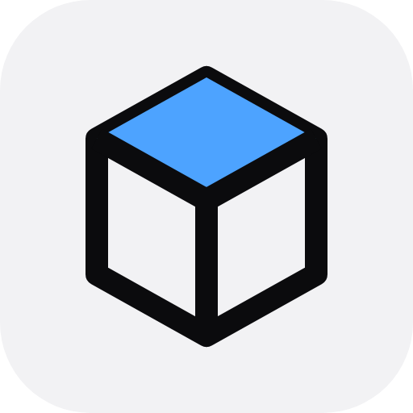

<p align="center"></p>

# macbox

**A real Mac for your coding agent.** macbox lets Claude Code, Codex, Cursor, or any MCP
client build, test, run, and tap through native iOS apps on a real Mac in the cloud, from
any machine, including Linux boxes and cloud agent sandboxes.

- **Build and test:** `xcodebuild` and your XCTest and UI tests, on a Mac mini running the
  latest Xcode. Your agent gets the results and the error lines.
- **Run and drive the app:** launch it on the iOS simulator, read what's on screen, tap,
  type, and swipe, so your agent can check its own work.
- **Watch live:** every running app gets a browser link where you can watch and use it too.

Pay per Mac minute, whole minutes only: $0.05, and a job under a minute is free. Get access
and free credit at **[macbox.build](https://macbox.build)**.

## Set up

The quickest way: tell your agent

> Set up macbox by following https://api.macbox.build/guide/

Or pick your client:

**Claude Code (plugin: skill + MCP tools)**

```sh
claude plugin marketplace add opslane/macbox-agent
claude plugin install macbox@macbox
```

**Any MCP client** (Codex, Cursor, Claude Desktop, VS Code, ...), with Node 18+:

```json
{
  "mcpServers": {
    "macbox": { "command": "npx", "args": ["-y", "macbox", "mcp"] }
  }
}
```

**The CLI** (macOS or Linux):

```sh
curl -fsSL https://api.macbox.build/install.sh | sh
macbox login
macbox setup      # installs the skill for Claude Code and Codex, and notes in CLAUDE.md / AGENTS.md
```

Log in with `macbox login`, or set `MACBOX_API_KEY` (in a cloud agent, as an environment
secret).

## What your agent gets

| MCP tool | CLI | What it does |
|---|---|---|
| `build` | `macbox build` | Build for the iOS simulator (or macOS, for a Mac app) |
| `test` | `macbox test` | Run tests on a fresh simulator; one PASS/FAIL line per test |
| `screenshot` | `macbox screenshot` | Launch the last build and return a picture |
| `run` | `macbox run` | Launch the app and keep it running; returns a live link |
| `describe`, `tap`, `type`, `swipe`, `press_button`, `look` | `macbox ui ...` | Use the running app like a person |
| `stop` | `macbox stop` | End the running app |
| `report_problem` | `macbox feedback` | Tell the macbox team when something on our side is wrong |

For deeper work there is also `macbox mcp --xcode`: Sentry's open-source
[MobileBuildMCP](https://www.mobilebuildmcp.com/) Xcode tools (LLDB debugging, Swift packages,
simulator settings), running on the macbox Mac.

## How it works

`macbox` sends the files git tracks (never `.env` files unless you ask) to one Mac mini,
into your own macOS VM that only you use and that can't reach other VMs or our network.
Only changed files are sent after the first time, and the build cache stays, so the second
build is fast. Native iOS apps work today: Xcode projects and workspaces, Swift packages,
CocoaPods, XcodeGen. Not yet: signing, TestFlight, React Native, Flutter.

Full guide: https://api.macbox.build/guide/ · Questions: [Discord](https://discord.gg/zukPCGsTnw)

## This repository

The open parts of macbox: the Claude Code plugin (`.claude-plugin/`, `skills/`, `.mcp.json`),
the `macbox` npm package (`npm/`, which downloads the CLI from api.macbox.build and checks
it against the published SHA256SUMS), and the MCP Registry entry (`server.json`). The macbox
service itself runs on our Macs.

MIT licensed.
